# AIRIV Sentinel

> **Clean open-source distribution.** This repository is the curated public source domain. Canonical private Git ancestry, private host evidence, private host-control material, credentials, authorization material, and internal release provenance are intentionally excluded.

[](https://github.com/arivonto/AIRIV-Sentinel-OSS/actions/workflows/ci.yml)
[](https://www.python.org/)
[](LICENSE)

A Linux-first autonomous operations Sentinel with deterministic, fail-closed authority, continuous observation, incident lifecycle management, policy-controlled remediation, independent verification, and auditable evidence.

AIRIV Sentinel is a Linux-first Autonomous Multi-AI Engineering Desktop evolved into a continuous operations Sentinel.

```text
One Mission.
Any AI.
Linux First.
```

Canonical precedence: `Contract > Implementation > Local Preference`.

## What is AIRIV Sentinel?

AIRIV Sentinel is a continuously operating Linux Sentinel that observes system state, preserves incident evidence, manages remediation through explicit policy boundaries, and verifies consequential effects independently. It is designed to operate continuously on a Linux workstation or server without requiring cloud infrastructure.

## Why AIRIV Sentinel?

Modern development environments run continuously — builds, tests, AI agents, and services do not stop at 5 PM. Yet most tooling assumes a human is always watching. Sentinel closes that gap without introducing uncontrolled autonomy.

The project favors local-first operation, deterministic auditable behavior, bounded automation, and fail-closed safety. AI may assist engineering and diagnostics, but repository contracts, policy boundaries, and Commander authority remain the source of operational truth.

See [Why AIRIV Sentinel](docs/WHY_AIRIV_SENTINEL.md) for the full motivation.

## What Works Today

- Deterministic queue-driven task execution with local, Roo, and Ollama adapters
- Continuous observation and system state normalization
- Incident lifecycle management with evidence trails
- Policy-controlled remediation with fail-closed defaults
- Independent post-execution verification
- Durable execution identity with replay protection
- SLO observation and health classification (HEALTHY / STALE / UNHEALTHY / UNKNOWN)
- CI/CD with GitHub Actions (kernel + integration tests)
- Curated open-source distribution

## Safety and Intentional Boundaries

AIRIV Sentinel intentionally does **not**:

- Claim full autonomy
- Invent its own remediation rules
- Retry indeterminate effects automatically
- Cross production-effect boundaries without explicit authority
- Depend on a single AI model or paid cloud API for safety

Autonomous production remediation is **not authorized**. All consequential effects require explicit Commander confirmation.

## Architecture Overview

```text
Observation
  → Investigation
  → Diagnosis
  → Commander Intent
  → Remediation Policy (ALLOW / DENY)
  → Execution Identity (claim once)
  → Execution
  → Independent Verification
  → Evidence
  → Incident Lifecycle
```

See [Architecture](docs/AIRIV_SENTINEL_V1_ARCHITECTURE.md) for details.



## Installation

```bash
git clone https://github.com/arivonto/AIRIV-Sentinel-OSS.git
cd AIRIV-Sentinel-OSS
python3 -m venv venv
./venv/bin/python -m pip install -r requirements-dev.txt
```

Requires Python >= 3.12 and Linux with systemd.

## Quick Start

Run one runtime cycle:

```bash
./venv/bin/python runtime_cli.py demo_queue.yaml
```

Expected: status line and exit code `0` (success) or `1` (failure).

Run the test suite:

```bash
PYTHONPATH=. ./venv/bin/pytest -q -x tests/
```

For detailed usage, see the [User Guide](docs/USER_GUIDE.md).

## Current Status

| Capability | Status |
|---|---|
| Deterministic task execution | Available |
| Incident lifecycle management | Available |
| Remediation policy engine | Available |
| Independent verification | Available |
| SLO observation & classification | Available |
| SLO enforcement (production integration) | In development |
| Autonomous production remediation | Not authorized |

See the [AIRIV Sentinel Roadmap](AIRIV_SENTINEL_ROADMAP.md) for details.

## Documentation

- [Architecture](docs/AIRIV_SENTINEL_V1_ARCHITECTURE.md)
- [Why AIRIV Sentinel](docs/WHY_AIRIV_SENTINEL.md)
- [User Guide](docs/USER_GUIDE.md)
- [Roadmap](AIRIV_SENTINEL_ROADMAP.md)
- [Security](SECURITY.md)
- [Contributing](CONTRIBUTING.md)
- [Changelog](CHANGELOG.md)

## Contributing

Contributions should preserve canonical contracts, safety boundaries, and fail-closed behavior. See [Contributing](CONTRIBUTING.md) for guidelines.

## Security

AIRIV Sentinel can perform consequential host operations when explicitly configured and authorized. See [Security](SECURITY.md) for vulnerability reporting and security invariants.

## Releases

AIRIV Sentinel is currently in pre-release development. Source is available from this repository. Formal GitHub Releases will be published when release artifacts are ready.

## License

Distributed under the [Apache License 2.0](LICENSE).
